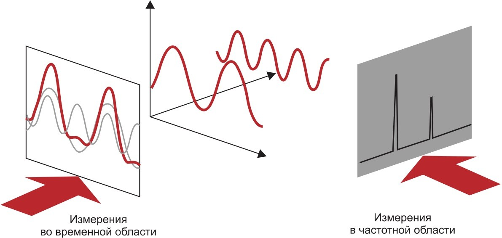
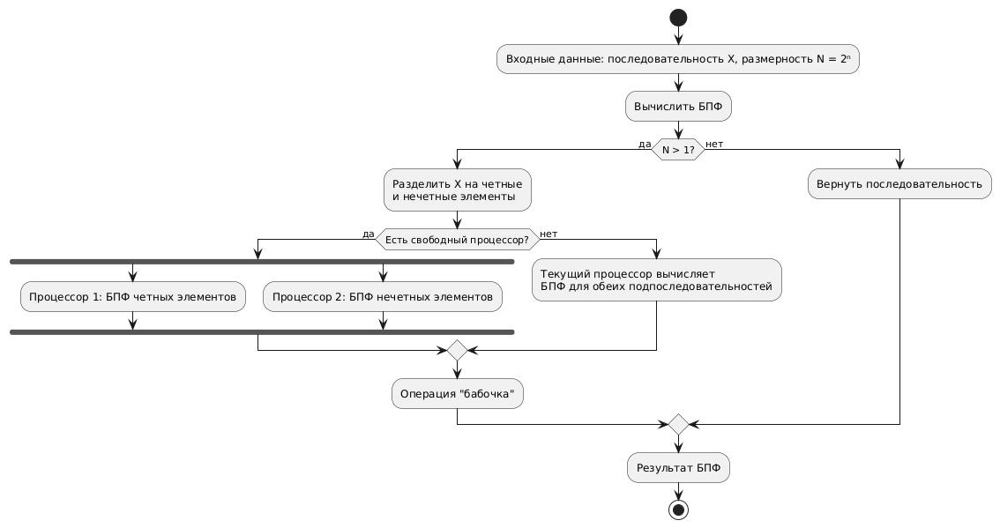
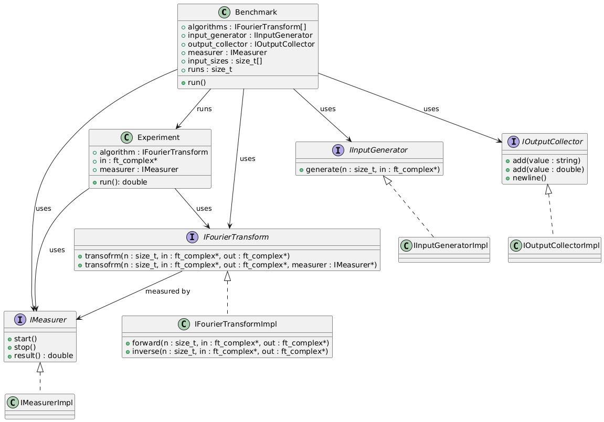

<!-- _paginate: false -->
<!-- _footer: Владивосток\n2025 -->

# Исследование алгоритмов БПФ и их параллельных форм

Выполнил: студент группы М9123-09.04.04рпис, А.В. Марков

Научный руководитель: Доцент департамента ПИиИИ, к.т.н., А.А. Чусов

<!-- Здравствуйте, уважаемые члены комиссии. Меня зовут Марков Андрей. Мой научный руководитель – Чусов Андрей Александрович. Тема моей выпускной квалификационной работы — исследование алгоритмов быстрого преобразования Фурье и их параллельных форм.
-->

---

# Актуальность работы

- БПФ — **основной инструмент** в цифровой обработке сигналов: изображения, аудио, видео, радиосвязь
- Объем обрабатываемых данных стремительно растет — требуется всё более быстрые алгоритмы для анализа
- Классические алгоритмы БПФ плохо масштабируются — важно адаптировать их **под многопроцессорные архитектуры**

<!-- В современном мире объём данных в прикладных задачах постоянно увеличивается — от обработки изображений до анализа сигналов. При этом задержки и энергопотребление становятся критичными, особенно в реальном времени или при работе на мобильных и встроенных устройствах. БПФ — фундаментальный алгоритм, лежащий в основе этих систем, и его оптимизация под современные параллельные вычислительные архитектуры — ключевая задача. Поэтому тема работы напрямую связана с актуальными направлениями в науке и промышленности.
-->

---

# Цель и задачи

**Цель:**  

Разработка и исследование параллельных реализаций алгоритмов БПФ.

**Задачи:**
1. Подготовить обзор алгоритмов БПФ и существующих библиотек
2. Выполнить анализ предметной области
3. Реализовать алгоритмы и выполнить эксперименты
4. Исследовать производительность в различных ситуациях
5. Сформулировать практические выводы по результатам исследования

<!-- Здесь представлены цели и задачи, которые направлены не только на теоретический анализ, но и на практическую реализацию с выводами о применимости алгоритмов в реальных задачах. Полученные результаты могут быть использованы как в инженерных решениях, так и в дальнейших научных исследованиях.
-->

---

<!-- _footer: Задача 1. Обзор алгоритмов БПФ и существующих библиотек -->

# Принцип работы ДПФ

Прямое ДПФ: $X[k] = \sum_{n=0}^{N-1} x[n] \cdot e^{-2\pi i \frac{kn}{N}}, \quad k = 0, 1, \dots, N-1$

Обратное ДПФ: $x[n] = \frac{1}{N} \sum_{k=0}^{N-1} X[k] \cdot e^{2\pi i \frac{kn}{N}}, \quad n = 0, 1, \dots, N-1$

<!-- Для начала немного рассмотрим дискретное преобразование Фурье, чтобы понимать некоторые аспекты. ДПФ нужен для перевода сигнала из временной области в частотную. Прямое ДПФ вычисляет спектр сигнала — набор комплексных коэффициентов, которые показывают амплитуду и фазу каждой гармоники, в то время как обратное ДПФ выполняет, как можно догадаться, обратную операцию. На этом слайде показаны два ключевых выражения — для прямого и обратного ДПФ, однако из-за квадратичной сложности алгоритм плохо масштабируется на большие данные.
-->

---

<!-- _footer: Задача 1. Обзор алгоритмов БПФ и существующих библиотек -->

# Обзор существующих алгоритмов

| Алгоритм    | Ключевые особенности                                                                                            |
| ----------- | --------------------------------------------------------------------------------------------------------------- |
| Кули–Тьюки  | Базовый алгоритм; эффективен при длине $N = 2^k$                                                                |
| Райдера     | Предназначен для простых чисел $N$; преобразует ДПФ в свёртку                                                   |
| Блюстайна   | Работает с произвольной длиной $N$                                                                              |
| Стокхама    | Итеративная структура; эффективен по памяти и легко распараллеливается                                          |
| Гуда–Томаса | Основан на КТО; не требует поворотных множителей; эффективен при взаимно простых множителях $N = N_1 \cdot N_2$ |

<!-- На слайде представлен подробный обзор ключевых алгоритмов БПФ. Каждый алгоритм решает свои задачи: Кули–Тьюки — базовый и наиболее часто применяемый, особенно при N=2^k; алгоритмы Райдера и Блюстайна применимы для чисел, неудобных для классического разложения, включая простые N; алгоритм Стокхама подходит для параллельных реализаций за счёт итеративной схемы и лучшей работы с памятью; алгоритм Гуда–Томаса эффективен при работе с длинами, разлагающимися на взаимно простые множители. Такой спектр методов позволяет подбирать оптимальный алгоритм под конкретные условия задачи.
-->

---

<!-- _footer: Задача 1. Обзор алгоритмов БПФ и существующих библиотек -->

# Сравнение библиотек БПФ

| Характеристика \ Библиотека   | FFTW | cuFFT | TurboFFT | NumPy/SciPy | PyCUDA/Numba |
| ----------------------------- | ---- | ----- | -------- | ----------- | ------------ |
| Поддержка CPU                 | +    | –     | –        | +           | –            |
| Поддержка GPU                 | –    | +     | +        | –           | +            |
| Высокая производительность    | +    | +     | +        | –           | +            |
| Оптимизация под архитектуру   | +    | –     | +        | –           | –            |
| Параллелизм (многопоточность) | +    | –     | +        | + (BLAS)    | –            |
| Аппаратная оптимизация        | –    | +     | +        | –           | +            |

<!-- Таблица отражает ключевые различия библиотек по архитектуре и производительности. FFTW хорош для CPU и многопоточности, cuFFT и TurboFFT — для GPU и высокой скорости, особенно при поддержке аппаратной оптимизации. NumPy удобен, но уступает в скорости, а PyCUDA требует ручной настройки. Выбор зависит от оборудования и задач.
-->

---

<!-- _footer: Задача 2. Анализ предметной области -->

# Метрики оценки эффективности

1. Время выполнения:
   $$T_{total} = O\left(\frac{C}{P}\right) + T_{comm}(N, P)$$   
2. Энергопотребление CPU:  
   $$E_{total}(P) = T_{total} \cdot P \cdot E_{CPU}$$
3. Энергоэффективность CPU:
   $$\eta(P) = \frac{C}{E_{total}(P)}$$  

<!-- Анализ эффективности параллельных реализаций алгоритмов БПФ требует учёта не только времени выполнения, но и энергозатрат. Время выполнения зависит от баланса между распараллеливанием и накладными расходами на коммуникацию. Энергопотребление растёт с увеличением числа процессоров, но может компенсироваться сокращением времени работы. Энергоэффективность показывает, насколько оптимально используются ресурсы. 
-->

---

<!-- _footer: Задача 3. Реализация алгоритмов и выполнение экспериментов -->

# Разработанные схемы

<!-- На слайде представлена блок-схема параллельной реализации классического алгоритма Кули-Тьюки. Алгоритм работает по принципу «разделяй и властвуй»: исходная последовательность делится на четные и нечетные элементы, которые обрабатываются независимо. Если доступны свободные процессоры, подзадачи выполняются параллельно, что ускоряет вычисления. Затем результаты объединяются с помощью операции «бабочка».
-->

---

<!-- _footer: Задача 3. Реализация алгоритмов и выполнение экспериментов -->

# Архитектура системы

- Язык реализации: C++
- Поддержка многопоточности (OpenMP + `std::thread`)
- Визуализация и анализ результатов в Jupyter Notebook
- Компоненты:
  - Генератор последовательностей
  - Исполнитель алгоритмов
  - Измерители (время, энергопотребление)

<!-- Система построена так, чтобы было удобно проводить эксперименты и масштабировать тестирование.
-->

---

<!-- _footer: Задача 3. Реализация алгоритмов и выполнение экспериментов -->

# Реализация

- Объектно-ориентированный подход (C++)
- Интерфейс алгоритмов: `IFourierTransform`
- Интерфейс измерителей: `IMeasurer`
- Визуализация при помощи библиотек: `matplotlib`, `pandas`

<!-- Реализация строится на современных принципах: модульность, повторное использование кода и наглядность.
-->

---

<!-- _footer: Задача 3. Реализация алгоритмов и выполнение экспериментов -->

# Диаграмма классов

<!-- -->

---

<!-- _footer: Задача 4. Исследование производительности в различных ситуациях -->

# Экспериментальное тестирование

- Наборы данных:
  - Синусоидальные сигналы
  - Случайные и импульсные последовательности
- Метрики:
  - Время выполнения
  - Энергопотребление

<!-- Тестирование проводится на типовых сигналах, чтобы оценить производительность в реальных условиях. Главными метриками производительности являются время и энергоэффективность.
-->

---

<!-- _footer: Задача 5. Практические выводы по результатам исследования -->

# Исследование

- Масштабируемость с увеличением числа потоков
- Эффективность алгоритмов:
  - При малых N — Стокхам
  - При больших N — Кули–Тьюки с произвольным основанием
- Энергосбережение с приближенными методами

<!-- Полученные данные показывают, какие алгоритмы эффективны в разных условиях, и как влияет число потоков на энергопотребление.
-->

---

# Заключение

1. Подготовлен обзор алгоритмов БПФ и существующих библиотек
2. Выполнен анализ предметной области
3. Реализованы алгоритмы и выполнить эксперименты
4. Исследована производительность в различных ситуациях
5. Сформулированы практические выводы по результатам исследования

**Цель достигнута, задачи решены**

<!-- Все поставленные задачи решены, исследование дало практический результат.
-->

---

# Практическая и научная значимость

- Практическая:
  - Оптимизация БПФ для многопроцессорных систем
  - Возможность адаптации под разные архитектуры

- Научная:
  - Расширение моделей оценки эффективности
  - Анализ приближённых методов и их применимости

<!-- Результаты работы могут быть применены как в индустрии, так и в дальнейшем научном исследовании.
-->

---

# Спасибо за внимание!

<!-- Благодарю за внимание, готов ответить на ваши вопросы.
-->
